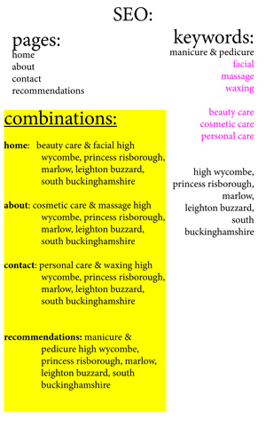
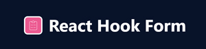
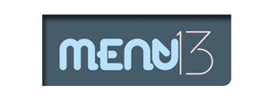
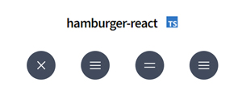
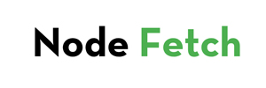

 
<!-- main logo -->

  
<!-- quick links:  -->
# Quick Links:  

<a href="#home">Home</a> 
<a href="#about">About</a> 
<a href="#frontEnd">Front End</a> 
<a href="#backEnd">Back End</a> 
<a href="#SEO">SEO</a> 
<a href="#hooksAndLibraries">Hooks & Libraries</a> 
<a href="#takeAways">Take Aways</a> 

  
<!-- ABOUT: -->

    

This project helps to promote business of local beautician Chanelle.
    

  
<!-- FRONT END: -->

    

Front end is engineered on NEXT JS and hosted with Vercel.
 

  
<!-- BACK END: -->

      

    Back end is based on NEXT JS pages/api.
    

  
<!-- SEO: -->

      

    SEO is planned as chart below:
    

    

    
<!-- HOOKS & LIBRARIES: -->

 
     
        
       
       
      
      
      

  
<!-- TAKE AWAYS: -->

      

    Learned to create component library and publish it on npm site. NPM package link to
    <a href="https://www.npmjs.com/package/@lucyderojas/menu13-next"> Menu13</a>
     Created a message dashboard with dynamic search bar and messages archive.
        

  

# Quick Links:  

<a href="#home">Home</a> 
<a href="#about">About</a> 
<a href="#frontEnd">Front End</a> 
<a href="#backEnd">Back End</a> 
<a href="#SEO">SEO</a> 
<a href="#hooksAndLibraries">Hooks & Libraries</a> 
<a href="#takeAways">Take Aways</a> 

